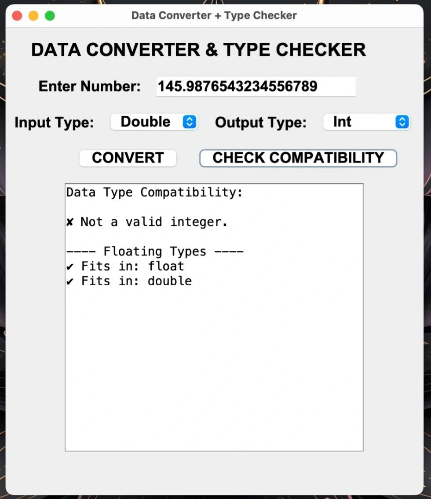
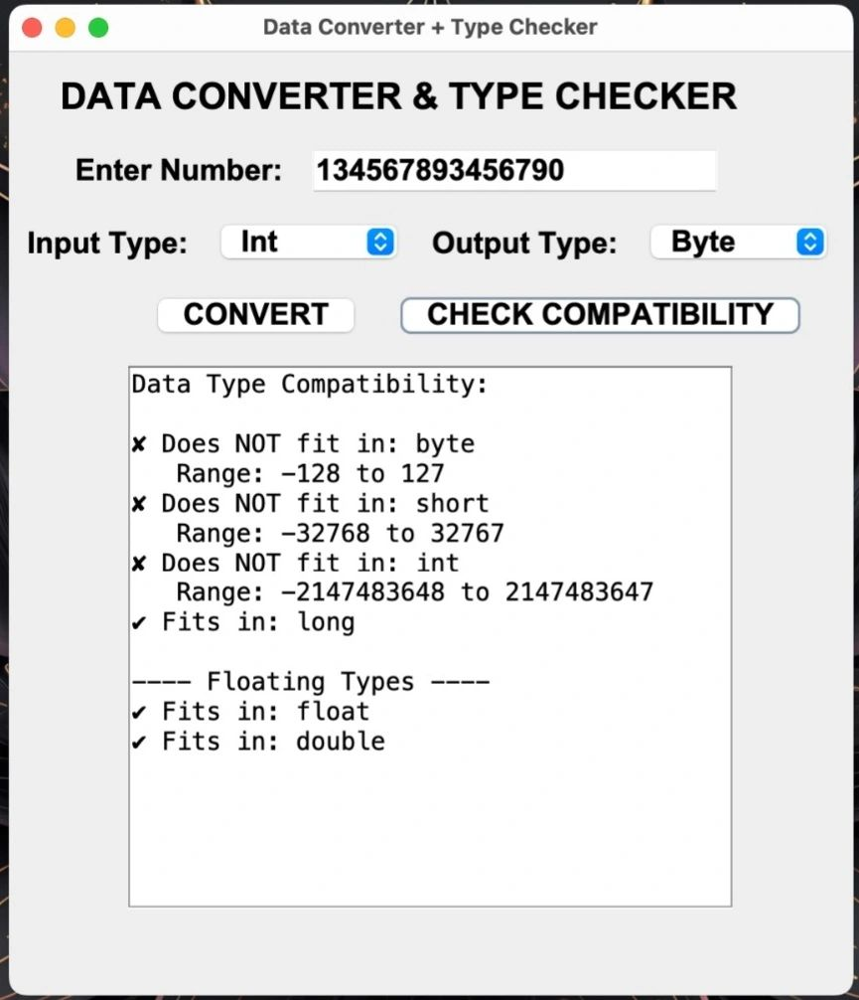
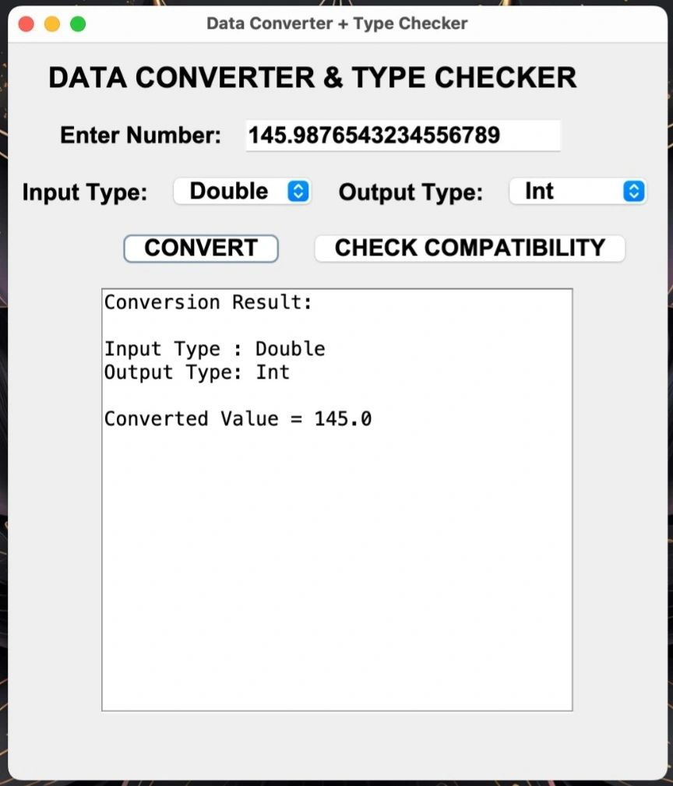
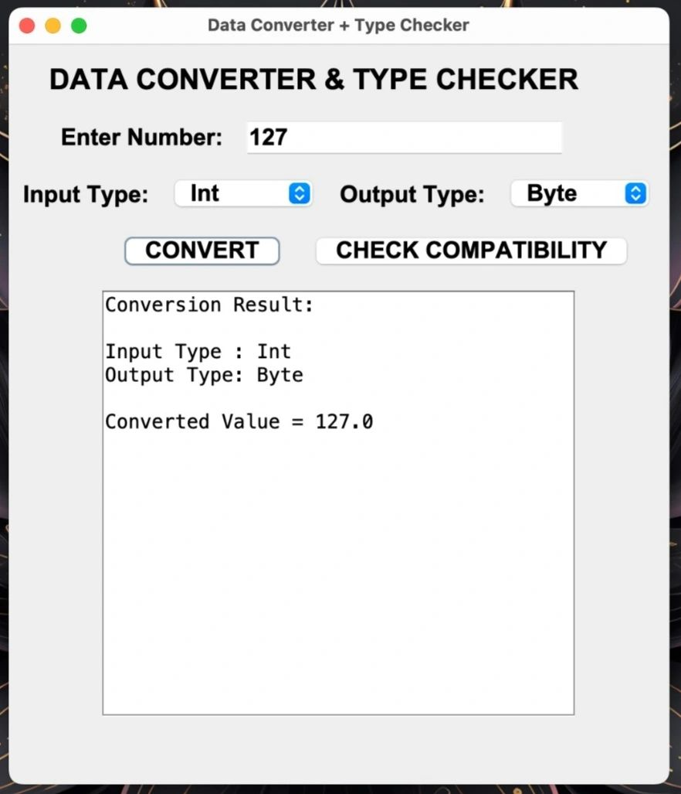

 Data Converter & Type Checker

A Java Swing desktop application that converts numeric values between Java primitive data types and checks whether a value is compatible with different data types based on their storage ranges.

---

📖 Overview

Data Converter & Type Checker is a GUI-based Java application developed using Swing and AWT. The application helps users understand Java primitive data types by providing conversion functionality and compatibility checking against the valid ranges of each data type.

This project demonstrates fundamental Java concepts such as type casting, exception handling, event-driven programming, and GUI development.

---

✨ Features

* Convert values between:

  * Byte
  * Short
  * Int
  * Long
  * Float
  * Double

* Check compatibility with:

  * byte
  * short
  * int
  * long
  * float
  * double

* Displays valid and invalid data types based on Java range limits

* Interactive graphical user interface

* Error handling for invalid inputs

* Scrollable output panel for displaying results

---

 🖼️ Application Screenshots

 Main Interface



Data Conversion



Compatibility Check



Output Display



---

 🛠️ Technologies Used

| Technology     | Purpose                           |
| -------------- | --------------------------------- |
| Java           | Core Programming Language         |
| Swing          | GUI Development                   |
| AWT            | Layout Management & UI Components |
| Event Handling | User Interaction                  |

---

 📂 Project Structure

```text
DataTool
├── DataTool.java
├── README.md
└── screenshots
    ├── screenshot1.jpeg
    ├── screenshot2.jpeg
    ├── screenshot3.jpeg
    └── screenshot4.jpeg
```

---

 ⚙️ How It Works

 Data Conversion

1. Enter a numeric value.
2. Select the input data type.
3. Select the output data type.
4. Click **Convert**.
5. View the converted result.

 Compatibility Check

1. Enter a numeric value.
2. Click **Check Compatibility**.
3. The application verifies whether the value fits within Java primitive data type ranges.
4. Results are displayed in the output area.

---

 🎯 Key Concepts Demonstrated

* Primitive Data Types
* Type Casting
* Data Type Conversion
* Exception Handling
* Java Swing GUI Development
* Event-Driven Programming
* Range Validation
* Object-Oriented Programming (OOP)

---

 🚀 Installation & Execution

 Clone the Repository

```bash
git clone https://github.com/your-username/DataTool.git
```

 Compile

```bash
javac DataTool.java
```

 Run

```bash
java DataTool
```

---

 🔮 Future Enhancements

* Binary, Octal, and Hexadecimal Conversion
* Dark Mode Support
* Export Results to File
* Improved UI Design
* Automatic Data Type Detection

---

👨‍💻 Author

**Lochana Lokhande**

Java Developer | Android Developer | Web Developer

* Technologies Used
Java
Java Swing
AWT
Event Handling (ActionListener)
Project Structure
DataTool/
│
├── DataTool.java
├── DataTool.class
└── README.md

* How It Works
1. Data Conversion
Enter a numeric value.
Select the input data type.
Select the output data type.
Click CONVERT.
The application performs type casting and displays the converted value.
2. Type Compatibility Check
Enter a numeric value.
Click CHECK COMPATIBILITY.
The application verifies whether the value fits within:
byte range
short range
int range
long range
float range
double range
Results are displayed along with range information for incompatible types.

*Concepts Demonstrated
Java Primitive Data Types
Type Casting
Data Type Conversion
Exception Handling
GUI Development with Swing
Event-Driven Programming
Range Validation
Object-Oriented Programming (OOP)

